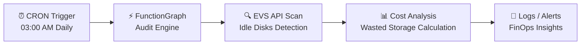

# ☁️ Huawei Cloud Serverless FinOps & Audit Engine

> **Enterprise-Grade Serverless FinOps Platform**  
> An autonomous, event-driven cloud cost optimization and audit engine built on Huawei Cloud.  
> Designed to detect idle resources, quantify waste, and enforce zero-waste infrastructure policies at scale.

---

<div align="center">


</div>

---

## 🌍 Overview

Cloud environments at enterprise scale often suffer from **hidden cost inefficiencies** — unused storage, detached volumes, and forgotten resources silently accumulating expenses.

This project introduces a **Serverless FinOps & Audit Engine** that:

- Detects idle cloud resources automatically  
- Quantifies wasted storage and cost impact  
- Provides actionable insights for optimization  
- Operates fully autonomously with zero manual intervention  

Built entirely using **Huawei Cloud native services**, this platform demonstrates how organizations can implement **continuous cost governance (FinOps)** using modern cloud-native principles.

---

## 🎯 Vision

> "You can't optimize what you don't continuously audit."

This project aims to enforce:

- **Zero-Waste Infrastructure**  
- **Continuous Cost Visibility**  
- **Autonomous Cloud Governance**  

By combining **Serverless computing, event-driven architecture, and Infrastructure as Code**, it ensures cost optimization becomes a **built-in system behavior**, not a manual task.

---

## 🏗️ Architecture Overview

### 🔁 Event-Driven Serverless FinOps Workflow



---

## 🧠 Architecture Breakdown

### 1️⃣ Serverless Compute Layer (FunctionGraph)

- Python-based audit engine deployed as a **FunctionGraph function**
- Executes only when triggered → **zero idle cost**
- Scales automatically based on execution demand  

---

### 2️⃣ Event-Driven Automation

- Triggered via **CRON schedule (daily at 03:00 AM)**  
- Fully automated auditing cycle  
- No manual execution required  

---

### 3️⃣ Cloud Resource Audit Logic

The engine performs:

- Scans **Elastic Volume Service (EVS)** disks  
- Identifies:
  - Detached volumes (`available` state)  
  - Unused storage resources  
- Calculates:
  - Total wasted storage (GB)  
  - Potential cost impact  

---

### 4️⃣ FinOps Insight Generation

- Outputs structured logs and audit summaries  
- Enables:
  - Cost visibility  
  - Resource optimization decisions  
  - Governance reporting  

---

### 5️⃣ Security & Access Control (IAM)

- Implements **Least Privilege Principle**  
- Uses **IAM Agency with ReadOnly permissions**
  - `EVS ReadOnlyAccess`  
- Ensures:
  - No mutation of resources  
  - Secure audit-only execution  

---

### 6️⃣ Infrastructure as Code (Terraform)

- Entire stack is provisioned via Terraform:
  - IAM roles & policies  
  - FunctionGraph deployment  
  - CRON triggers  
  - Code packaging (ZIP)  

✅ Fully reproducible  
✅ Version-controlled infrastructure  
✅ Zero manual setup  

---

## ⚙️ Core Principles

- **Serverless First** → No idle infrastructure cost  
- **Event-Driven Execution** → Automated lifecycle  
- **FinOps by Design** → Cost optimization as a system feature  
- **Least Privilege Security** → Safe cloud auditing  
- **IaC Everything** → Fully declarative infrastructure  

---

## 📂 Repository Structure

```text
.
├── infrastructure/
│   ├── provider.tf         # Huawei Cloud provider & archive configuration
│   ├── iam.tf              # IAM Agency & least-privilege policies
│   └── function.tf         # FunctionGraph setup, packaging & CRON triggers
│
└── src/
    ├── audit_engine.py     # Core audit logic (Huawei Cloud SDK - EVS scanning)
    └── requirements.txt    # Python dependencies
```

---

## 🚀 Deployment Guide

### ⚙️ Prerequisites

- Terraform (v1.0+)  
- Python 3.10+  
- Huawei Cloud account with API credentials  

---

## 1️⃣ Initialize Infrastructure

```bash
cd infrastructure
terraform init
```

---

## 2️⃣ Plan Deployment

```bash
terraform plan
```

---

## 3️⃣ Deploy Stack

```bash
terraform apply -auto-approve
```

### 🔄 What Happens Automatically?

- Python source code is packaged into a ZIP archive  
- FunctionGraph function is created  
- IAM roles and permissions are configured  
- CRON trigger is attached  
- Audit engine becomes active  

---

## ⚡ Runtime Behavior

Once deployed:

- The system runs **every night at 03:00 AM**  
- It scans the `tr-west-1` region  
- Detects:
  - Idle EVS disks  
  - Detached volumes  
- Calculates:
  - Total wasted storage (GB)  
- Outputs:
  - Logs  
  - Cost insights  

---

## 📊 Example Output

```text
[INFO] Scanning EVS volumes in region: tr-west-1
[INFO] Found 5 idle volumes
[INFO] Total wasted storage: 320 GB
[INFO] Estimated monthly waste: $XX
```

---

## 💡 Key Capabilities

- ⚡ Serverless cost optimization engine  
- 🔍 Automated cloud resource auditing  
- 📊 Real-time FinOps insights  
- 🔐 Secure read-only access model  
- 🔄 Fully automated scheduling  
- ☁️ Cloud-native architecture  
- 📦 Infrastructure as Code (Terraform)  

---

## 🧠 What This Project Demonstrates

- Enterprise-level **FinOps practices**  
- Serverless cloud architecture design  
- Cost optimization strategies in cloud environments  
- Secure IAM-based access control  
- Automated auditing pipelines  
- Real-world cloud governance implementation  

---

## 👨‍💻 Developer

**Ali Gaffar Toksoy**  

Cloud Engineering • DevOps • FinOps  

> "Cloud isn't expensive — unmanaged cloud is."

---

## ⭐ Final Note

This project showcases how **modern FinOps practices** can be automated using serverless technologies.

Instead of manually tracking costs, the system:

✔ Detects waste  
✔ Quantifies impact  
✔ Enables optimization  

All in a fully automated, cloud-native workflow.

If you found this project valuable, consider giving it a ⭐

---